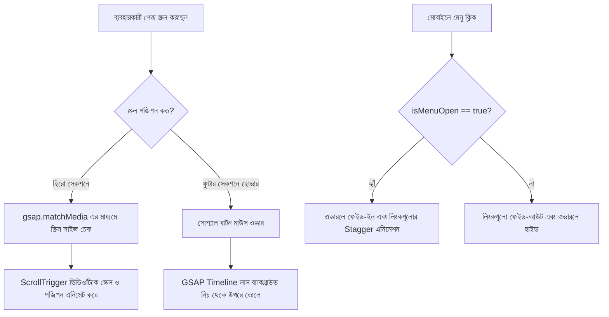

# Da Vinci Studio Website - প্রজেক্ট গাইড এবং এনিমেশন বিবরণী

এই প্রজেক্টটি একটি আধুনিক ক্রিয়েটিভ ডিজিটাল এজেন্সির ওয়েবসাইট। এটি **Next.js 16 (App Router)**, **TypeScript**, **React 19**, **Tailwind CSS v4**, এবং **GSAP (GreenSock Animation Platform)** ব্যবহার করে তৈরি করা হয়েছে। 

প্রজেক্টের পুরো আর্কিটেকচার, ফোল্ডার স্ট্রাকচার, কম্পোনেন্টসমূহ এবং এনিমেশনের কাজ কীভাবে করা হয়েছে তা নিচে বিস্তারিত বাংলায় বর্ণনা করা হলো:

---

## ১. প্রজেক্টের ফোল্ডার স্ট্রাকচার (Folder Structure)

প্রজেক্টের মূল ফাইলসমূহ `src` ফোল্ডারের ভেতরে বিন্যস্ত রয়েছে:

```
src/
├── app/                  # Next.js App Router (মেটাডেটা, গ্লোবাল স্টাইল এবং মূল লেআউট)
│   ├── globals.css       # গ্লোবাল স্টাইলশিট, Tailwind v4 থিম কনফিগারেশন এবং CSS এনিমেশন
│   ├── layout.tsx        # মূল HTML লেআউট, ফন্ট লোডিং (Montserrat & Proxima Nova) এবং SEO মেটাডেটা
│   └── page.tsx          # হোমপেজের মূল ভিউ (সবগুলো সেকশন এখানে রেন্ডার করা হয়েছে)
│
├── components/           # প্রজেক্টের রিউজেবল ইউজার ইন্টারফেস কম্পোনেন্ট
│   ├── homepage/         # হোমপেজের নির্দিষ্ট সেকশনসমূহ
│   │   ├── Hero.tsx      # স্ক্রল-ট্রিগার ভিডিও জুমিং এনিমেশন সহ হিরো সেকশন
│   │   ├── Blogs.tsx     # ব্লগ এবং নিউজের গ্রিড লেআউট কার্ড
│   │   └── VideoPlayingContainer.tsx # ভিডিও স্ক্রলিং এর ফাঁকা প্লেসহোল্ডার সেকশন
│   │
│   ├── shared/           # শেয়ারড বা কমন কম্পোনেন্ট (Navbar ও Footer)
│   │   ├── Navbar.tsx    # ডেক্সটপ মেনু এবং GSAP এনিমেশন বিশিষ্ট মোবাইল হ্যামবার্গার ড্রয়ার
│   │   └── Footer.tsx    # সোশ্যাল বাটন হোভার এনিমেশন এবং লার্জ ব্র্যান্ডিং সহ ফুটার
│   │
│   └── countdown.tsx     # কাউন্টডাউন টাইমার (ভবিষ্যত লঞ্চিং এর জন্য হাইড্রেশন-সেফ ফিচার)
│
└── lib/                  # ইউটিলিটি ফাংশনসমূহ
    └── utils.ts          # clsx এবং tailwind-merge এর সমন্বয়ে `cn` ক্লাস মার্জার ফাংশন
```

---

## ২. মূল পেজ এবং কম্পোনেন্টের বর্ণনা (Pages & Components)

### ক. লেআউট এবং SEO (`src/app/layout.tsx`)
- **ফন্ট লোডিং:** এই ফাইলে `Montserrat` এবং `Proxima Nova` নামক লোকাল ফন্ট লোড করে CSS ভ্যারিয়েবল তৈরি করা হয়েছে (`--font-montserrat` এবং `--font-proxima`)।
- **SEO ও মেটাডেটা:** Next.js-এর `Metadata` এপিআই ব্যবহার করে সার্চ ইঞ্জিন অপ্টিমাইজেশন (SEO), ওপেন গ্রাফ (OpenGraph) এবং টুইটার কার্ড কনফিগার করা হয়েছে, যা সাইটটিকে সোশ্যাল মিডিয়ায় শেয়ার করার জন্য প্রিমিয়াম লুক দেয়।

### খ. হোমপেজ রাউটার (`src/app/page.tsx`)
- এটি প্রজেক্টের মূল প্রবেশদ্বার। এখানে ৫টি প্রধান সেকশন উপর থেকে নিচে সাজানো হয়েছে:
  1. `<Navbar/>`
  2. `<Hero/>`
  3. `<VideoPlayingContainer/>`
  4. `<Blogs/>`
  5. `<Footer/>`

---

## ৩. এনিমেশন কীভাবে কাজ করছে? (Animation Processes)

সাইটটির মূল আকর্ষণ হলো এর স্মুথ ইন্টারঅ্যাকশন এবং মোশন ইফেক্ট। এখানে এনিমেশনের জন্য মূলত দুটি সিস্টেম ব্যবহার করা হয়েছে: **GSAP** (জাভাস্ক্রিপ্ট এনিমেশন) এবং **CSS Keyframes** (টেইলউইন্ড এনিমেশন)।

### ১. হিরো ভিডিওর স্ক্রল জুম এনিমেশন (`src/components/homepage/Hero.tsx`)
* **প্রক্রিয়া:** ব্যবহারকারী যখন স্ক্রল করেন, তখন হিরো সেকশনের ভিডিওটি স্ক্রিনের ডানপাশ থেকে বড় হয়ে বামপাশে এসে জুম এবং পজিশন চেঞ্জ করে সেট হয়ে যায়।
* **কীভাবে করা হয়েছে:**
  - এনিমেশনের জন্য `gsap.matchMedia()` ব্যবহার করা হয়েছে, যা স্ক্রিন সাইজের ওপর ভিত্তি করে রেসপনসিভ এনিমেশন দেয়।
  - `is2xl` (১৫৩৬ পিক্সেল বা তার বেশি) এবং `isXl` (১২৮০ থেকে ১৫৩৫ পিক্সেল) স্ক্রিনের জন্য আলাদা আলাদা কনফিগারেশন (`scale`, `x` এবং `y` পজিশন) নির্ধারণ করা হয়েছে।
  - `ScrollTrigger` প্লাগইনের সাহায্যে ভিডিওর মুভমেন্ট সরাসরি মাউস স্ক্রলের সাথে লিংক করা হয়েছে (`scrub: true`)। ব্যবহারকারী নিচে স্ক্রল করলে ভিডিওটি স্কেল আপ হয়ে জায়গা মতো বসে, আর উপরে স্ক্রল করলে আবার আগের জায়গায় ফেরত যায়।
  - ভিডিওর এই জুম ইফেক্টকে জায়গা দেওয়ার জন্য `<VideoPlayingContainer/>` নামক একটি ফাঁকা সেকশন রাখা হয়েছে, যা ব্যাকগ্রাউন্ডে ভিডিওটিকে স্ক্রল হওয়ার জন্য অতিরিক্ত ৩৫০px থেকে ৮১৫px জায়গা করে দেয়।

### ২. সোশ্যাল বাটন স্লাইড হোভার এনিমেশন (`src/components/shared/Footer.tsx`)
* **প্রক্রিয়া:** ফুটারের সোশ্যাল মিডিয়া লিংকগুলোতে মাউস নিলে একটি লাল রঙের ব্যাকগ্রাউন্ড নিচ থেকে খুব মসৃণভাবে উপরে উঠে আসে। মাউস সরিয়ে নিলে সেটি আবার নিচে নেমে যায়।
* **কীভাবে করা হয়েছে:**
  - প্রতিটি বাটনে `.red-bg` নামের একটি পজিশনড ডিভ আছে।
  - প্রথমে `gsap.set(redBg, { yPercent: 100 })` দিয়ে লাল ব্যাকগ্রাউন্ডটিকে বাটনের নিচে লুকিয়ে রাখা হয়।
  - প্রতিটি বাটনের জন্য একটি করে লোকাল `gsap.timeline({ paused: true })` তৈরি করা হয়, যা লাল ব্যাকগ্রাউন্ডটিকে `yPercent: 0` তে এনিমেট করে।
  - বাটনে `mouseenter` ইভেন্ট লিসেনার অ্যাড করে টাইমলাইনটি প্লে করা হয় (`tl.play()`) এবং `mouseleave` এ টাইমলাইনটি রিভার্স করা হয় (`tl.reverse()`)।

### ৩. মোবাইল ড্রয়ার মেনু এনিমেশন (`src/components/shared/Navbar.tsx`)
* **প্রক্রিয়া:** মোবাইল স্ক্রিনে ডানপাশের হ্যামবার্গার বাটনে ক্লিক করলে পুরো স্ক্রিন জুড়ে মেনু ওভারলে ভেসে ওঠে এবং লিংকগুলো একের পর এক উপর থেকে নিচে নেমে আসে (Stagger Effect)।
* **কীভাবে করা হয়েছে:**
  - `isMenuOpen` স্টেট পরিবর্তন হলে `useGSAP` হুকটি ফায়ার হয়।
  - মেনু অন হলে ওভারলের অপাসিটি `0` থেকে `1` এনিমেট হয়। একই সাথে `linksRef.current.children` (সবগুলো লিংক) অপাসিটি `0` এবং `y: 30` থেকে `y: 0` তে চলে আসে। `stagger: 0.06` দেওয়ার কারণে প্রতিটি লিংক একে অপরের থেকে ০.০৬ সেকেন্ড দেরিতে আসে, যা একটি চমৎকার ফ্লো তৈরি করে।
  - মেনু বন্ধ করার সময় লিংকগুলো আগে নিচে নেমে অদৃশ্য হয় এবং সবশেষে ওভারলে বন্ধ হয়ে যায়।
  - ব্যবহারকারীর উইন্ডোতে যদি `prefers-reduced-motion` অন থাকে, তবে এই হেভি জাভাস্ক্রিপ্ট এনিমেশনটি স্কিপ করা হয়, যা অ্যাক্সেসিবিলিটি (Accessibility) নিশ্চিত করে।

### ৪. সিএসএস কীফ্রেম এনিমেশনসমূহ (`src/app/globals.css`)
কিছু রিইউজেবল এনিমেশন সরাসরি টেইলউইন্ডে কীফ্রেম দিয়ে করা হয়েছে:
- **`animate-shimmer`:** টেক্সটের ওপর একটি আলোকরশ্মির মতো লাইট ইফেক্ট তৈরি করে যা ক্রমান্বয়ে ডান থেকে বামে যায়। (সাধারণত প্রমোশন বা হাইলাইটেড লেখায় ব্যবহৃত হয়)।
- **`animate-fade-up`:** যেকোনো সেকশন বা টেক্সট রেন্ডার হওয়ার সময় নিচ থেকে একটু ব্লার ইফেক্ট সহ ভেসে ওঠে।
- **`animate-aurora`:** ব্যাকগ্রাউন্ডে একটি অরোরার মতো কালার গ্লো তৈরি করে যা ঘুরতে থাকে ও বড়-ছোট হয়।
- **`animate-float-slow`:** হালকা ফ্লোটিং ইফেক্ট দেয়, যা কার্ড বা উপাদানকে শূন্যে ভাসমান অনুভব করায়।

---

## ৪. থিমিং এবং কালার সিস্টেম (Design System)

প্রজেক্টে Tailwind v4 এর ইনলাইন থিম স্কিম ব্যবহার করা হয়েছে। মূল কালার টোকেনগুলো `src/app/globals.css` ফাইলের `:root` এ ডিফাইন করা হয়েছে:

- **Primary Color (`--primary-color` / `#010101`):** প্রজেক্টের প্রধান ডার্ক ব্যাকগ্রাউন্ড।
- **Recording Red (`--recording-red` / `#F60100`):** ব্র্যান্ড কালার হিসেবে লাল রঙ ব্যবহার করা হয়েছে যা অ্যাকশন বাটন, হোভার এবং লোগো হাইলাইটে ব্যবহৃত হয়।
- **Secondary Dark (`--secondary-dark` / `#464646`):** সেকেন্ডারি কার্ড ব্যাকগ্রাউন্ড এবং বাটন বর্ডার।
- **Body Color (`--body-color` / `#909090`):** বডি টেক্সটের জন্য হালকা ধূসর কালার।
- **White Color (`--white-color` / `#F4F4EA`):** মূল টাইটেল ও অফ-হোয়াইট হেডিং টেক্সট।

---

## ৫. সংক্ষেপে প্রজেক্টটির রেন্ডারিং ও এনিমেশন ফ্লোচার্ট



এই প্রজেক্ট গাইডটি আপনাকে পুরো প্রজেক্টের কোডবেস এবং মোশন বিহেভিয়ার সহজে বুঝতে ও পরবর্তীতে নতুন কোনো ফিচার যোগ করতে সাহায্য করবে।
